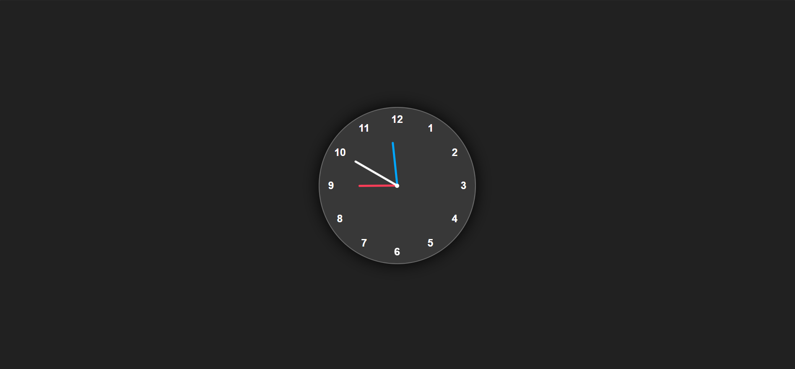

# Analog-Clock-By-JavaScript

A simple and elegant analog clock implementation using HTML, CSS, and JavaScript. The clock features a clean design with hour, minute, and second hands that update in real-time.

## Preview

The clock features a sleek dark theme with:

- White numbers on a dark background
- Red hour hand
- Blue minute hand
- White second hand
- Subtle shadow effects for depth

## Project Structure

The project consists of three main files:

### 1. `index.html`

- Contains the basic HTML structure of the clock
- Includes the clock container with number markers (1-12)
- Features three hands (hour, minute, second) with different colors and lengths
- Links to the CSS and JavaScript files

### 2. `style.css`

- Defines the visual appearance of the clock
- Uses flexbox for centering the clock on the page
- Implements a dark theme with a background color of #212121
- Creates the circular clock face with a subtle border and shadow
- Styles the clock numbers and hands with different colors:
  - Hour hand: Red (#ff3d58)
  - Minute hand: Blue (#00a6ff)
  - Second hand: White (#ffffff)

### 3. `script.js`

- Handles the clock's functionality
- Gets references to the clock hands using DOM elements
- Updates the rotation of each hand based on the current time
- Uses `setInterval` to update the clock every second
- Calculates proper angles for each hand:
  - Hour hand: 30 degrees per hour + offset for minutes
  - Minute hand: 6 degrees per minute
  - Second hand: 6 degrees per second

## How It Works

The clock functions by continuously updating the rotation of each hand based on the current time. The JavaScript code retrieves the current time using the `Date` object and calculates the appropriate rotation angles for each hand. The hands are then rotated using CSS transforms, creating a smooth analog clock movement.
